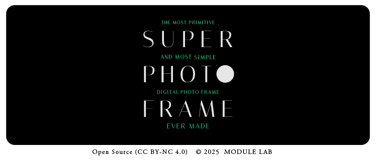

## SuperPhotoframe - Digital Photo Frame



[日本語版はこちら / Japanese version](README_ja.md)

SuperPhotoframe is a Raspberry Pi‑based digital photo frame that aims for high speed, stability, and a minimal experience.  
It eliminates typical IoT frustrations such as random disconnections and authentication errors, and quietly blends editorial‑style, beautifully laid‑out photos into your everyday life.

You can DIY the entire system at low cost (≈ \$200–300) using only off‑the‑shelf parts available worldwide.  
※ For detailed bill of materials, please refer to the build guide.

## License

This project is released under the **CC BY-NC 4.0** (Creative Commons Attribution-NonCommercial 4.0 International) license.

- ✅ Free to use, modify, and redistribute for **non‑commercial** and personal use  
- ✅ Attribution is required  
- ❌ Commercial use is prohibited  

Details: https://creativecommons.org/licenses/by-nc/4.0/

**© 2025 MODULE LAB** — Open Source under CC BY-NC 4.0  
github.com/modulelab/Superphotoframe  
For commercial use inquiries, please contact the author.

## System Requirements

- **Hardware**: Raspberry Pi 4 (recommended: 4GB RAM or more)  
- **OS**: Raspberry Pi OS Bookworm legacy 64bit (Wayland / labwc)  
- **Python**: System Python 3.11 or equivalent  
- **Storage**: 32GB or larger microSD card  
- **Network**: WiFi  

## Main Features

### 💡 Intended Use Cases

- Quietly display photos in a living room or kitchen  
- Minimal digital signage / photo frame use in shops  
- Naturally enjoy photos stored on NAS, USB, or cloud in daily life  

### 📸 Photo Display

- Automatic slideshow  
- Fade‑in / fade‑out transitions  
- Ken Burns effect (zoom)  
- Caption display (camera model, date)  
- Date scrub function (via rotary encoder)  
- Native resolution output<small> (e.g. 1024×600, configured on Wayland using `wlr-randr`)</small>  

### 🌐 Network Features

- **Automatic detection and mount of DLNA / SMB**  
- **Automatic Wi‑Fi configuration from USB memory**  
- Web‑based settings screen  
- QR‑code access to the settings screen  

### 💾 Photo Sources

1. **USB memory** – Reads directly from the `Photo/` folder  
2. **NAS / DLNA** – Network media servers  

### 🎮 Controls

- Rotary encoder (rotate / push)  
- Haptic feedback (DRV2605L / I2C)  

## Setup

### 1. Prepare the OS Image

#### 1‑1. Download Raspberry Pi OS

```bash
https://github.com/modulelab/Superphotoframe/releases/download/untagged-7cfb2b76434e88283ecf/2025-10-01-raspios-bookworm-arm64.img.xz
```

#### 1‑2. Write OS to the SD card with Raspberry Pi Imager

- For device, select **Raspberry Pi 4**  
- For OS, choose **Use custom image** and select the image downloaded in step 1  
- Select the SD card as the write destination  

#### 1‑3. “Edit Settings”

- Hostname: `raspiframe`  
- User: `jd`  
- Password: any of your choice  
- Wi‑Fi SSID and password  
- Move to the **Services** tab  
  - Enable **SSH** (password authentication)  

#### 1‑4. After the write is complete, safely eject the SD card.

### 2. Prepare Media and Network

- Format the USB memory as FAT32 or exFAT  
- Place `wifi.txt`, `credentials.txt`, and the `Photo` folder on the root of the USB memory  
  <small>※ A template is included in `USB.zip`. Unzip it and place the contents directly in the top level of the USB drive.</small>  
- Store photos in the `Photo` folder, organized by subfolders. Year‑based folders such as `20xx` are recommended.  
  <small>※ Resize photos so that the long side is around 1500px. Very large images may cause slow performance.</small>  
- You can add photos later by simply adding them to the same folder structure.  
- If you plan to use NAS / DLNA, fill in authentication information in `credentials.txt`.  
  <small>For example, create a dedicated DLNA user in your NAS settings and enter that information here.</small>  

### 3. Assemble the Main Unit

- Assemble the enclosure following the build guide.  
- Insert the SD card created in step 1, and plug the USB memory into the blue USB port.  

### 4. Install SuperPhotoframe

- From a PC terminal, connect to the Pi 4 via SSH and install the necessary software from the terminal.  
- First, run the following commands in the terminal to find the IP address of the Pi 4 (it will look like `192.168.xx.xx`):  

```bash
ping raspiframe.local
```

- Then connect via SSH to the identified IP address:  

```bash
ssh jd@192.168.xx.xx
```

With SSH connected, run the following commands in order.  
<small>※ When the terminal is showing a prompt where you can type commands, you are ready to run the next command.</small>  

```bash
sudo apt install -y git python3 python3-venv python3-pip
```

```bash
curl -fsSL https://deb.nodesource.com/setup_20.x | sudo -E bash -
sudo apt install -y nodejs
```

```bash
sudo reboot
```

&nbsp;  
**After the reboot completes and the GUI desktop appears, connect via SSH again and continue:**  

```bash
cd ~
git clone https://github.com/modulelab/Superphotoframe.git
cd Superphotoframe
git checkout v1.0.1
```

```bash
python3 -m venv ~/raspiframe-venv
source ~/raspiframe-venv/bin/activate
pip install -r requirements.txt
```

```bash
chmod +x setup_dlna.sh
./setup_dlna.sh
```

During execution, a few questions will appear in the command line. Answer as follows:  

- Install rotary encoder service? (y/n): **y** then Enter  
- Configure display rotation?: just press **Enter** to skip  
- Force HDMI hotplug detection? (recommended for photo frames) (y/n): **y** then Enter  
- Configure auto-login? (y/n): **y** then Enter  

Next, run:  

```bash
sudo raspi-config
```

- A configuration screen similar to a PC BIOS will appear. Navigate to **System Settings → S7 Splash Screen** and select **“No”**, then move to **“Finish”**.  
  ※ Use the arrow keys to move the cursor and Enter to confirm.  

Finally:  

```bash
sudo reboot
```

That completes the setup 🎉  
<br>
- After boot, a QR code will appear on the screen. Scan it with your smartphone to open the settings page.  
- From the settings page, select the folder you want to display and save. The slideshow will start.  
- Adjust options such as margins and duration per photo as needed, then save.  

## Startup Sequence

1. **WiFi configuration** – Reads `wifi.txt` from USB and connects automatically  
2. **Service startup** – Backend / API starts (uvicorn)  
3. **Display settings** – Applies 1024×600 portrait mode on Wayland (via `wlr-randr`)  
4. **Kiosk mode** – Chromium launches and shows `static/start.html` in full‑screen  
5. **Player** – Transitions to `static/player.html` and starts the slideshow  

## API Specification

### DLNA

- `GET /api/dlna/discover` – Discover DLNA services  
- `GET /api/dlna/status` – Check mount status  
- `POST /api/dlna/mount` – Mount  
- `POST /api/dlna/unmount` – Unmount  

### USB

- `GET /api/usb/photo` – USB photo folder information  

### Settings

- `GET /api/config` – Get configuration  
- `POST /api/config` – Save configuration  
- `GET /api/selection` – Get selected folders  
- `POST /api/selection` – Save selected folders  

### Playlist

- `GET /api/playlist` – Get image list  
- `GET /api/events` – SSE event stream  

## File Structure

```bash
Superphotoframe/
├── app/
│   └── main.py              # Main application
├── static/
│   ├── player.html          # Player screen
│   ├── settings.html        # Settings screen
│   ├── logo.png             # Logo image
│   ├── settinglogo.png      # Settings screen logo
│   └── qr2.png              # QR code (auto-generated)
├── data/
│   ├── config.json.sample   # Configuration file sample
│   └── selection.json.sample # Selected folder sample
├── rotary.py                # Rotary encoder script
├── setup_dlna.sh            # Setup script
├── setup_wifi_from_usb.py   # WiFi configuration script
├── startup_pipeline.sh      # Startup pipeline
├── usb-mount.sh             # USB auto-mount script
├── usb-unmount.sh           # USB auto-unmount script
├── 99-usb-mount.rules       # udev rules
├── requirements.txt         # Python dependencies
├── wifi.txt.sample          # WiFi settings sample
├── credentials.txt.sample   # Credentials sample
└── README.md                # This file
```

## Security Notes

⚠️ **Important**:  

- `wifi.txt` and `credentials.txt` are stored in plain text  
- We recommend using a guest or isolated network  

## Changelog

### v1.0.0 / v1.0.0-dev.1

- Optimized for Wayland / labwc environment with 1024×600 native display  
- Permanently disables Chromium translation panel  
- Supports rotary rotation / press and DRV2605L haptics  
- Automates setup end‑to‑end (virtual environment, systemd, I2C)  


